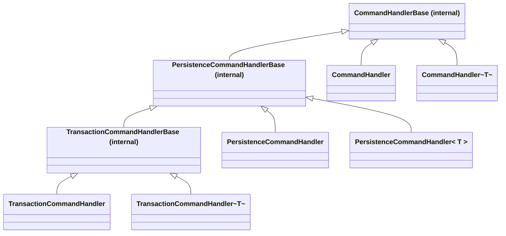

```mermaid
classDiagram
    direction TB

    %% Internal Spine
    class CHB["CommandHandlerBase (internal)"]
    class PCHB["PersistenceCommandHandlerBase (internal)"]
    class TCHB["TransactionCommandHandlerBase (internal)"]

    CHB <|-- PCHB
    PCHB <|-- TCHB

    %% Command Handlers
    class CH_V["CommandHandler"]
    class CH_T["CommandHandler~T~"]
    CHB <|-- CH_V
    CHB <|-- CH_T

    %% Persistence Handlers
    class PCH_V["PersistenceCommandHandler"]
    class PCH_T["PersistenceCommandHandler< T >"]
    PCHB <|-- PCH_V
    PCHB <|-- PCH_T

    %% Transaction Handlers
    class TCH_V["TransactionCommandHandler"]
    class TCH_T["TransactionCommandHandler~T~"]
    TCHB <|-- TCH_V
    TCHB <|-- TCH_T
```
